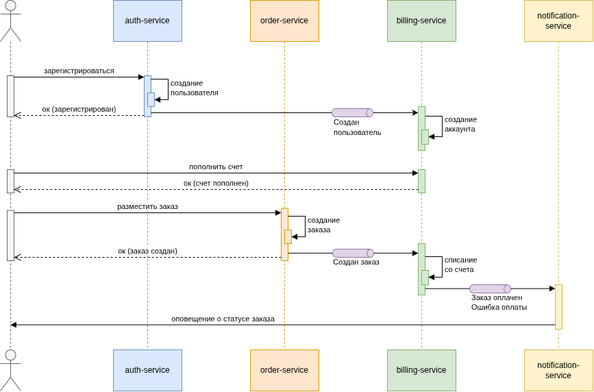
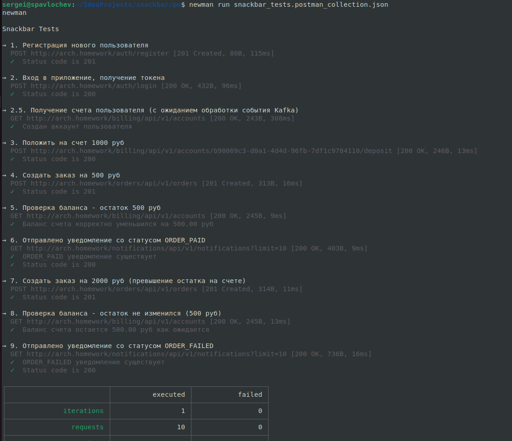

# Закусочная, Микросервисная Архитектура

## Оглавление

- [Описание](#описание)
  - [Общие сведения](#общие-сведения)
  - [Стиль взаимодействия микросервисов друг с другом](#стиль-взаимодействия-микросервисов-друг-с-другом)
  - [Контракты взаимодействия](#контракты-взаимодействия)
- [Установка приложения](#установка-приложения)
  - [Подготовка](#подготовка)
  - [Создание неймспейсов](#создание-неймспейсов)
  - [Развёртывание PostgreSQL и инициализация баз данных](#развёртывание-postgresql-и-инициализация-баз-данных)
  - [Развёртывание Kafka](#развёртывание-kafka)
  - [Установка Traefik](#установка-traefik)
  - [Развёртывание микросервисов приложения](#развёртывание-микросервисов-приложения)
  - [Ingress](#ingress)
- [Тестирование](#тестирование)

## Описание

### Общие сведения

Приложение реализовано как набор следующих микросервисов:
* `auth-service`. Сервис, отвечающий за регистрацию и аутентификацию пользователей, создает и валидирует JWT, 
публикует события пользователя.
* `order-service`. Сервис заказов, отвечает за создание заказа и публикацию событий заказа.
* `billing-service`. Сервис оплаты, отвечает за операции по счету клиента, слушает события, связанные с пользователем и  
  заказом, публикует события, связанные с действиями по счету.
* `notification-service` Сервис уведомлений, подписан на доменные события, отвечает за отправку уведомлений клиенту.

### Стиль взаимодействия микросервисов друг с другом

Сервисы не вызывают друг друга напрямую. Они публикуют и слушают доменные события при помощи брокера сообщений **Kafka**. 
Стиль взаимодействия **Event Collaboration**.

Используемые топики в Kafka:
* `users` - события пользователя (UserCreated)
* `orders` - события заказа (OrderCreated)
* `payments` - платежные события (OrderPaymentCompleted, OrderPaymentFailed)

Схемы указанных событий реализованы в отдельной библиотеке **[contracts](contracts)**, которая добавляется как зависимость к каждому микросервису.

Описание схем событий (protobuf):
[events.proto](contracts/src/main/proto/events.proto)

Следующая sequence-диаграмма показывает как реализовано взаимодействие сервисов. Отражен сценарий регистрации нового пользователя 
в системе, создание и пополнение счета, оформление заказа с последующим списанием денежных средств со счета и отправкой
уведомления о состоянии заказа.

### Контракты взаимодействия

Для взаимодействия с пользователем в каждом микросервисе описаны контракты в файлах api.yaml:
* [auth-service-api.yaml](auth-service/src/main/resources/openapi/auth-service-api.yaml)
* [billing-service-api.yaml](billing-service/src/main/resources/openapi/billing-service-api.yaml)
* [notification-service-api.yaml](notification-service/src/main/resources/openapi/notification-service-api.yaml)
* [order-service-api.yaml](order-service/src/main/resources/openapi/order-service-api.yaml)
  
Для направления трафика в нужный микросервис используется префикс в запросе, который "вырезается" ингрессом при
перенаправлении запроса в целевой сервис:
* http://arch.homework/orders/api/v1/ - запрос к сервису заказов по пути api/v1/
* http://arch.homework/billing/api/v1/ - запрос к сервису оплаты по пути api/v1/
* http://arch.homework/notifications/api/v1/ - запрос к сервису уведомлений по пути api/v1/
* http://arch.homework/auth/api/v1/ - запрос к сервису аутентификации по пути api/v1/

## Установка приложения

### Подготовка

1. Должен быть установлен и запущен minikube
2. Необходимо в отдельной сессии запустить: `minikube tunnel`
3. В терминале перейти в директорию `snackbar/k8s`

### Создание неймспейсов

Для развертывания приложения используется 3 неймспейса:
1. `infra` - для Postgres и Kafka. 
2. `app` - микросервисы приложения и ингресс-роутинг.
3. `ingress` - выделенный неймспейс для Traefik.

Для создания неймспейсов выполнить команду `kubectl apply -f 00-namespaces.yaml`.

### Развёртывание PostgreSQL и инициализация баз данных

Для каждого микросервиса создается отдельная база данных на общем сервере.

`kubectl apply -f 01-infra/db-secrets.yaml` \
`helm install postgresql oci://registry-1.docker.io/bitnamicharts/postgresql --namespace infra -f 01-infra/db-values.yaml` \
`kubectl apply -f 01-infra/db-init-configmap.yaml -f 01-infra/db-init-job.yaml`

### Развёртывание Kafka

`kubectl apply -f 01-infra/kafka.yaml -f 01-infra/kafka-init-job.yaml`

### Установка Traefik

`helm repo add traefik https://traefik.github.io/charts` \
`helm repo update` \
`helm install traefik traefik/traefik --namespace ingress`

### Развёртывание микросервисов приложения

`kubectl apply -f 02-app/common-secrets.yaml \` \
`-f 02-app/auth-service.yaml \` \
`-f 02-app/billing-service.yaml \` \
`-f 02-app/order-service.yaml \` \
`-f 02-app/notification-service.yaml` \

### Ingress

`kubectl apply -f 02-app/traefik-routing.yaml`

## Тестирование

Коллекция тестов Postman: [tests](pm/snackbar_tests.postman_collection.json)

Для запуска тестов перейти в директорию `snackbar/pm` и использовать утилиту `newman`. 

Команда для прогона всех тестов: \
`newman run snackbar_tests.postman_collection.json`

Так как в тестах используется имя хоста `arch.homework`, то предварительно нужно в файл `/etc/hosts` добавить строку
маппинга для внешнего IP traefik.

Так как в приложении используется асинхронное взаимодействие сервисов между собой, то в тестах используется 
механизм ретраев, который позволяет проверить нужное поведение с некоторой отсрочкой.

Скриншот локального прогона тестов:

